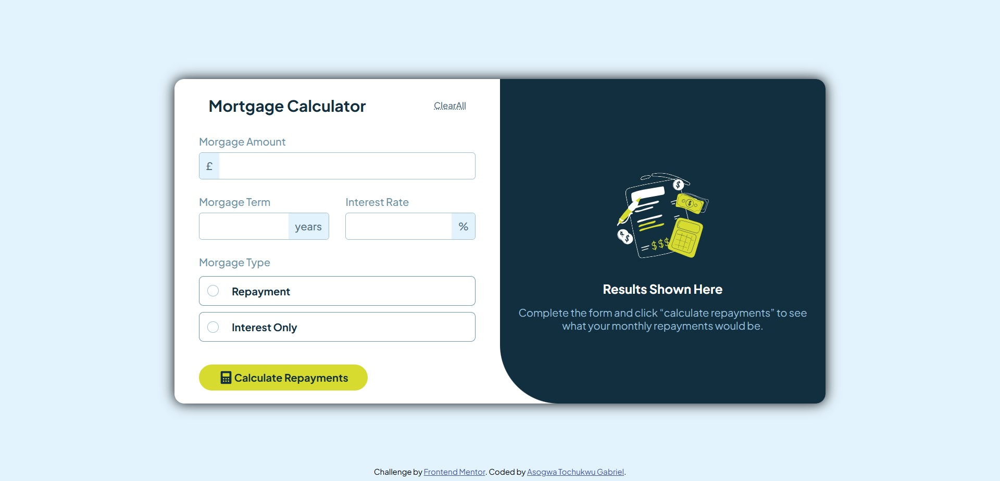

# Frontend Mentor - Mortgage repayment calculator solution

This is a solution to the [Mortgage repayment calculator challenge on Frontend Mentor](https://www.frontendmentor.io/challenges/mortgage-repayment-calculator-Galx1LXK73). Frontend Mentor challenges help you improve your coding skills by building realistic projects. 

## Table of contents

- [Overview](#overview)
  - [The challenge](#the-challenge)
  - [Screenshot](#screenshot)
  - [Links](#links)
- [My process](#my-process)
  - [Built with](#built-with)
  - [What I learned](#what-i-learned)
  - [Useful resources](#useful-resources)
- [Author](#author)


## Overview
**
This is a mortgage calculator app, which means it receives input, 
formats it to a more readable input, 
and then generates a monthly and total bill based on the mortgage amount, term, and rate**


### The challenge

Users should be able to:

- Input mortgage information and see monthly repayment and total repayment amounts after submitting the form
- See form validation messages if any field is incomplete
- Complete the form only using their keyboard
- View the optimal layout for the interface depending on their device's screen size
- See hover and focus states for all interactive elements on the page

### Screenshot




### Links

- Solution URL: [Solution URL](https://github.com/Tochukwu-1/Frontend-Mentor---Mortgage-repayment-calculator)
- Live Site URL: [Live site URL](https://tochukwu-1.github.io/Mortgage-repayment-calculator/)

## My process
- Adding of semantic HTML to separate the webpage into different sections.
- Creation of JSX files and adding them to their various sections.
- Styling of different components as regards to the desktop design.
- Declaring of states and passing them to their various jsx functions.
- Writing of the conditions and formulas.
- Ensuring the form can be filled by only inputs.
- Setting up the inputs to allow other values(. or , or both) aside numbers based on requirement.
- Different screen sizes designs(mobile, desktop, ipad, tabs, etc..).
- Finishing touches on the work (slight restyling, code restructuring and others).

### Built with

- Semantic HTML5 markup
- CSS custom properties
- Flexbox
- CSS Grid
- Mobile-first workflow
- [React](https://react.dev/)


### What I learned

- Formatting and reconfiguring a given input.
- stying of parent element of child focused element.
```css
element:focus-within {
  color: papayawhip;
} 
/* changes the font color of the element if an element within it is focused on */
```
```js
handleInput(e){
    const rawValue = e.target.value.replace(/,/g, ""); // Remove existing commas
    const numberValue = parseFloat(rawValue);
    console.log(isNaN(numberValue));
    const formattedValue = new Intl.NumberFormat("en-US").format(numberValue);
    setCalculationValue({
      ...calculationValue:
      [e.target.name] : formattedValue;
    })
}
// this process here, receives an input , removes any existing commas, converts it to number, puts a comma on the number for every 3 digits excluding the 1st one.
```


### Useful resources

- [Resource 1](https://w3schools.com) - This helped me for focus-within styling and other css styles


## Author

- Frontend Mentor - [@Tochukwu-1](https://www.frontendmentor.io/profile/Tochukwu-1)
- Twitter - [@A__Gabriel__T](https://x.com/A__Gabriel__T)

